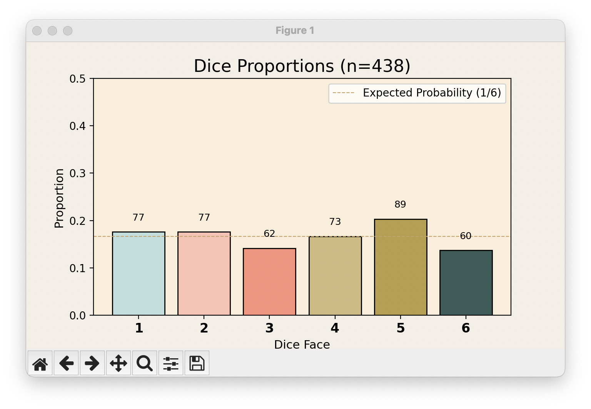
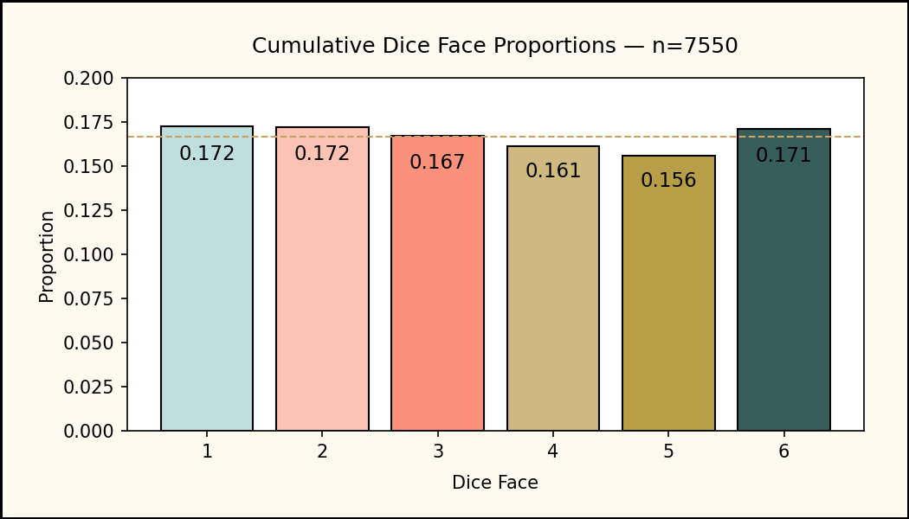
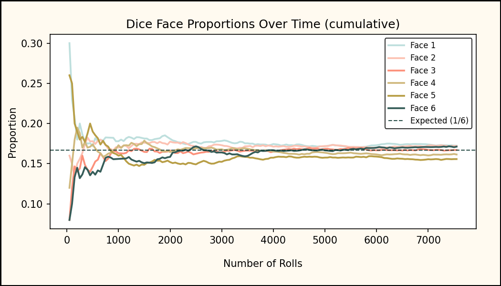

## probability-stream-06-joannafarris

P6: Plan and draft a custom streaming data project. 

---
# Probability Stream with Random Outcomes

This project simulates dice rolls as a continuous data stream using a Python generator.  

It demonstrates how random outcomes converge toward expected values over time.

The consumer reads each event as it arrives, updates running counts, and calculates live proportions for all six faces. 

A Matplotlib animation displays these proportions as an updating bar chart, showing how the distribution of rolls gradually converges toward the expected probability of **1/6 per face**.

---

### Insight and Focus

The main insight is observing **probability stabilization** — how random outcomes begin unevenly but converge toward a predictable distribution over time.  

By tracking proportions in real time, this stream demonstrates the **Law of Large Numbers** in a visual and interactive way.

Each message (a single dice roll) is processed as follows:
1. **Producer (Generator):** emits a dice face (1–6) as a JSON event.  
2. **Consumer:** receives the event, updates running totals for each face, and recalculates proportions.  
3. **Visualization:** redraws the bar chart live, displaying both proportions and running counts.

This process turns an abstract probability principle into a streaming, data-driven visualization.

---

### Run Instructions

#### 1. Activate your virtual environment
```bash
source .venv/bin/activate
```

#### 2. Install dependencies  
```bash  
pip install -r requirements.txt 
```

#### 3. Run the producer
```bash
python -m producers.dice_producer
```

#### 4. Run the consumer (with animation) 
```bash 
python -m consumers.animate_dice 
```  

### Dynamic Visualization

The live Matplotlib animation displays:

- Six color-coded bars (one for each dice face)  
- Real-time count labels above each bar  
- A dashed reference line at the expected probability (1/6)  
- Keyboard controls for interaction:  
  - **Space** — Pause / Resume  
  - **X** — Stop (freeze chart)  
  - **Q** — Quit  

The chart background uses warm, muted tones for visual balance, and proportions are scaled from **0 to 0.5** to reduce whitespace while keeping the trend readable.

---

### Example Visualization



---
### Data & Logging


Originally, the project processed the stream entirely in memory. It has been extended to write **periodic snapshots** for offline analysis.


Each snapshot row includes:
- Timestamp 
- Total rolls (`n`) 
- Cumulative counts (`c1..c6`) 
- Cumulative proportions (`p1..p6`)


Snapshots are appended to a CSV during the stream so you can analyze runs after the fact.

---

## Offline Snapshot Analysis

The analysis tooling in this repository reads the snapshot CSV and produces a compact report of each run.

**Artifacts (saved in `./reports/`):**
- **faces_distribution.png** — final snapshot bar chart of cumulative proportions (with per-bar labels). 
- **faces_trend.png** — cumulative proportions over time for faces 1–6, with an expected 1/6 reference line. 
- **summary.csv** — one row per run with final `n`, chi-squared (`chi2`), `max_abs_dev`, and `p1..p6`. A new “run” is inferred whenever `n` decreases (stream restart).


**How to run (from repo root):** 
```bash
python tools/analyze_snapshots.py
```

 or

```bash
python -m tools.analyze_snapshots
```
---

### Example Outputs


- The distribution chart shows how close observed proportions are to the theoretical 1/6 line after many rolls. 



- The trend chart visualizes the convergence process for each face over time. 



---

### Future Directions

- Add real-time bias detection during streaming.  
- Compare multiple dice (or other random generators) side-by-side.  
- Stream snapshots to a lightweight database for longer-term aggregation or a dashboard.

---

**Author:** Joanna Farris  
**Course:** DATA 644 — Streaming Data Analytics  
**Institution:** Northwest Missouri State University
